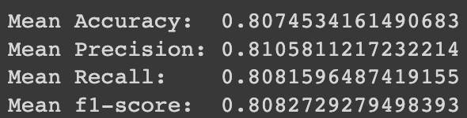

 

# ASL Classification for Augmented Reality Interactive Learning
Author:  
Alexander Claudino Daffara  
https://medium.com/@alexanderdaffara  
https://www.linkedin.com/in/alexanderdaffara/

> ## Every day, 33 babies are born with permanent hearing loss in the U.S., and ~90% of parents are unprepared
______________________________________________________________________________________________________________  

Welcome to my repo, where I combine data analysis with advanced machine learning algorithms to optimize the task of classifying ASL signs.

## Business Problem
In 2017, researchers at Georgia Tech university released the app PopSign! Using dynamic image classification game where users use ASL signs to control a cannon and pop the bubbles. The app tackles the rich idea of gamifying the learning process for learning ASL, targeting parents and relatives of deaf individuals. Unfortunately, there hasn't been enough development with the concept in comparison to the leaps in computer vision technology we've seen in AI research.  

Six years later, Google releases their 'Isolated Sign Language Recognition' Dataset as part of a Kaggle competition. So I will help enhace PopSign's educational games.

## Goals
 - Accurately classify ASL sign from video footage
 - Optimize lightweighted-ness of our model for scalability and ease of use for a phone app
 - Optimize *recall* for more common words
 - Demonstrate the proof of concept for fututre testing and Deployment

## Data Understanding
Google's Isolated Sign Language Recognition Dataset (54.43 GB):
 - 94k short clips (about 7-40 frames) of isolated ASL signs
 - 250 unique signs represented
 - 21 unique signers

The video footage has been preprocessed through MediaPipe's Holistic Solution model, mapping points (landmarks) on the face, hands and body as x-y-z coordinates in the frame.
Every clip comes in a .parquet file, where each row contains:
 - *row_id* : unique id string combining the other features
 - *frame* : frame number
 - *type* : the body part this landmark is part of (face, pose, right_hand, left_hand)
 - *landmark_index* : id of the landmark within it's *type*
 - *x*, *y*, *z* : coordinate positions normalized [ 0,1 ], although the Holistic model has not been optimized to accurately map depth *z*

Finally, for each frame we consistently have:
 - Face landmarks: 468 rows
 - Pose landmarks: 33 rows
 - Right hand landmarks: 21 rows
 - Left hand landmarks: 21 rows

## Data Gathering and EDA
Since my intent is to classify each .parquet file as an ASL sign, I will populate a new dataset with each row representative of the data from a file.
The method for data preprocessing I'll be using for this iteration of the project is: for each landmark, including only the x-y position from the first frame, as well as the vector of change in position to the last frame. Totalling 2172 features per file.  
Here is a vizualization of the features kept, for a single file signing "dad":  
 

There is certainly more information to be gained from the in-between frames, which I will preprocess further while the competition is active and this project develops. Unfortunately there are too many missing coordinates, relevant to those landmarks being off screen. With clever imputation I could bypass that with a mapping of 5-10 total vectors per video. For the moment, and for the purpose of lightweighted-ness, I would like to see how the models fair with this limited signal.  

Otherwise, the x and y positions and vector features fit a neat gaussian distribution:  
  

We will be testing our models with 5 targets and 87 targets, eventually getting to the full 250 targets.  
I notice a slight target imbalance and will use SMOTE (Synthetic Minority Oversampling Technique) to avoid false positives in majority classes and maximize recall for the words we'd expect to see most often in a ASL learning environment.  

## Baseline Model - Logistic Regression
Using only 5 total targets, Logistic regression performed quite well, but performance dropped off significantly at 87 targets:  
left - 5 targets  
right - 87 targets  
  

## Model Iteration 2 - Random Forest Classifier
After hyperparameter tuning, a random forest classifier had high scores for 87 targets, but failed to ever predict many of the signs:
  

  

## Model Iteration 3 - Histogram XGBoost Classifier
The default XGBoost Classifier using the histogram tree method (tree_method = 'gpu_hist') succeeded in predicting all targets all targets at least once, and performed great overall:  
   

## Model Iteration 4 - Histogram XGBoost Classifier + SMOTE
With hyperparameter tuning and SMOTE during training results improved even more:  
   

The model also performed well in recall for common words:    
  

## Conclusions and Future Improvements
 - Scalable: Our final model maintains performance as we increase number of signs to predict.
 - Lightweight: Model is intrinsically faster to train and predict compared to other sophisticated models.
 - Optimized for common words.

As I continue work on this project I would like to explore extracting more information from each video file, and in the case of deployment for production, it would be good to add more signers and ensure the model adapts to new environments the signers find themselves in.

Learn More about MediaPipe's solutions:
https://google.github.io/mediapipe/solutions/holistic.html

Kaggle Competition Link:
https://www.kaggle.com/competitions/asl-signs/overview
